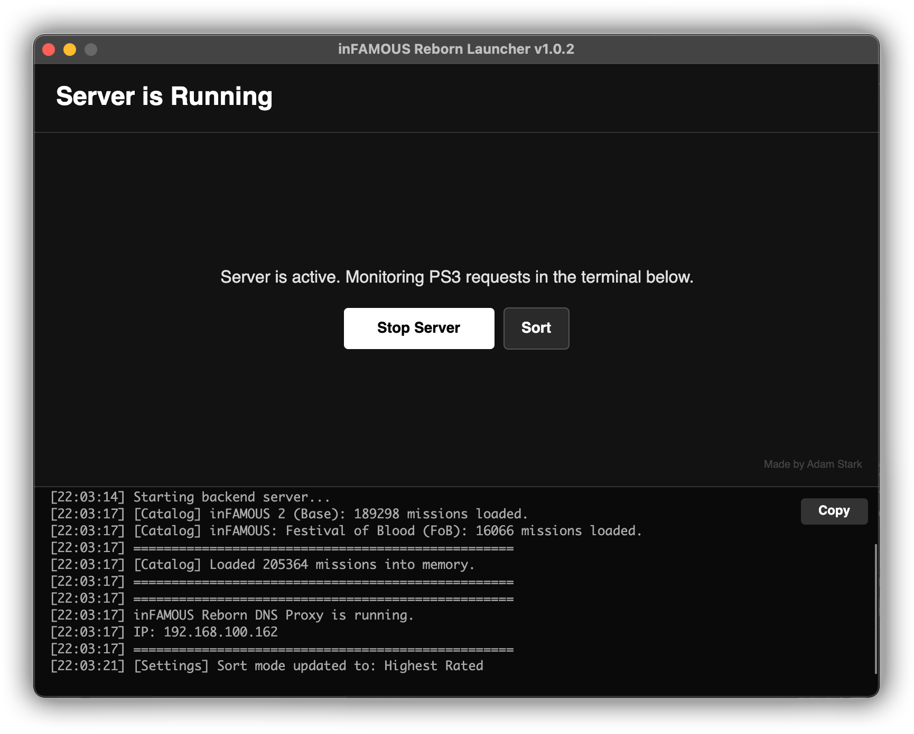

# inFAMOUS Reborn PS3
> [!IMPORTANT]
> This project brings back **205,364 missions** in total, supporting inFAMOUS 2 and inFAMOUS: Festival of Blood.

A cross-platform custom server and launcher to restore User-Generated Content (UGC) functionality for **inFAMOUS 2** and **inFAMOUS: Festival of Blood** on the PlayStation 3.

| BEFORE: UGC Error | AFTER: UGC Online |
| :---: | :---: |
|  |  |

These screenshots are from inFAMOUS 2. I achieved the same result for inFAMOUS: Festival of Blood as well.

## Download
**Please leave a star ⭐ if you found this repository helpful!**  
📅 **14/09/2026:** Release 1.0.2 is here!

You can download the compiled versions for your operating system here:  
**[Download Latest Release.](https://github.com/adamstark1/inFAMOUS-Reborn-PS3/releases)**

| UI Screenshot |
| :---: |
|  |

## How to Run
> [!NOTE]
> The application was tested on Windows 11 and macOS Tahoe.
### Windows
1. Extract the downloaded `.zip` file or compile it yourself with `Compilers/build_windows.sh` (use [Git Bash](https://git-scm.com/install/) terminal).
2. Run `inFAMOUSReborn.Launcher.exe`.

### macOS
1. Extract the downloaded `.zip` file or compile it yourself with `Compilers/build_mac_silicon.sh` or `Compilers/build_mac_intel.sh`.
2. Double-click the `inFAMOUS Reborn.app` bundle. 

## Setup Instructions

1. **Clear Ports:** Click the button in the Launcher to free Port 53 (DNS) and Port 80 (HTTP). These are required for the application to intercept PS3 traffic.
2. **Download Missions:** The Launcher will automatically download and extract the required mission files from Archive.org. These downloads might take a while depending on your connection, don't panic.
3. **PS3 Network Configuration:** 
   * On your PS3, go to **Settings > Network Settings > Internet Connection Settings**.
   * Select **Custom**.
   * Select **Wired Connection** or **Wireless**.
   * Go through the settings normally until you reach **DNS Setting**.
   * Select **Manual**.
   * Enter the IP address shown in the Launcher as your **Primary DNS**.
   * Leave the **Secondary DNS** blank (or `0.0.0.0`).
   * Save settings and test the connection.
4. **Optional Step:** Open the **Internet Browser** on your PS3 and head to http://infamous2-release.ps3.online.scea.com/. If you see my message, you're perfectly set.
5. **Start Server:** Once the files are ready, click "Start Server". The terminal will display if the missions loaded successfully and your local IP address. Boot the game.

## Sponsors and Contributors
I'd like to give a huge thank you to everyone who helped with this repository. This projects improves overtime thanks to you!

❤️ **Sponsors:** [@ffv2-droid](https://github.com/ffv2-droid)  
🛠️ **Troubleshooting:** [@CacturnatorCAN](https://github.com/CacturnatorCAN), [@ineed2remember-netizen](https://github.com/ineed2remember-netizen), [@f0cuswOw](https://github.com/f0cuswOw), [@saladthieves](https://github.com/saladthieves)

You can support my coding journey and revival projects on [GitHub Sponsors](https://github.com/sponsors/adamstark1).

## Tips
🏆 Fastest way to get all 3 UGC related trophies for **inFAMOUS 2**:
- Set **Mission Filters** to **Newest**, **Any**, **Any**.
- Search for **"2 fast trophies"** and replay the mission 25 times.

## Troubleshooting

> **"The mission download fails or times out"**  
The automated download can time out if Archive.org servers are under heavy load. You can download the files manually:
* [Base Missions (inFAMOUS 2)](https://archive.org/download/infamous-2-ugc/maps_by_name.zip)
* [Festival of Blood Missions](https://archive.org/download/infamous-fob-ugc/maps_by_name.zip)

Extract them and place the contents into the `Missions/base` and `Missions/fob` directories next to the Launcher.

> **"0 Missions found / Infinite loading on search"**  
Check your folder structure. The game cannot read nested directories. Ensure your paths look exactly like this:
* `Missions/base/[mission files]`
* `Missions/fob/[mission files]`

Incorrect structure: `Missions/base/maps_by_name/[mission files]` (Remove the `maps_by_name` folder).

>**"Port 53 or Port 80 in use / Server fails to start"**  
If the built-in port clearer fails, manually kill the conflicting processes:
* **macOS:** Open Terminal and run `sudo kill -9 $(sudo lsof -t -i :80)`.
* **Windows:** Open Command Prompt as Administrator and run `for /f "tokens=5" %a in ('netstat -aon ^| findstr :80 ^| findstr LISTENING') do taskkill /f /pid %a`.

Executing one of these commands will free up Port 80, and the Launcher will function properly.

>**"Permission denied for compiler .sh scripts"**  
Adjust permissions for these files manually:
* **macOS (Intel):** use `chmod +x build_mac_intel.sh` in Terminal.
* **macOS (Silicon):** use `chmod +x build_mac_silicon.sh` in Terminal.
* **Windows:** use `chmod +x build_windows.sh` in Git Bash terminal.

>**"ERROR: Read-only file system : '/private/var/folders/.../d/Missions'"**  
This error can occur on macOS (Intel and Silicon):

Pressing the **Download & Extract** button may fail with an error due to Apple's [Gatekeeper](https://en.wikipedia.org/wiki/Gatekeeper_(macOS)) security feature. This can be fixed by moving the app bundle:
* Close the app first (`inFAMOUS Reborn.app`) if it's already running.
* **Move** (*not copy*) the app to another location (e.g. `Desktop`) with a drag and drop.
* **Move** the app back to the previous location with a drag and drop.
* Reopen the app by double-clicking it and proceed as normal.

## Tech Stack

* **Backend:** ASP.NET Core (Kestrel web server)
* **DNS Routing:** Custom DNS proxy handling UDP port 53 traffic to reroute PSN URLs to the local host.