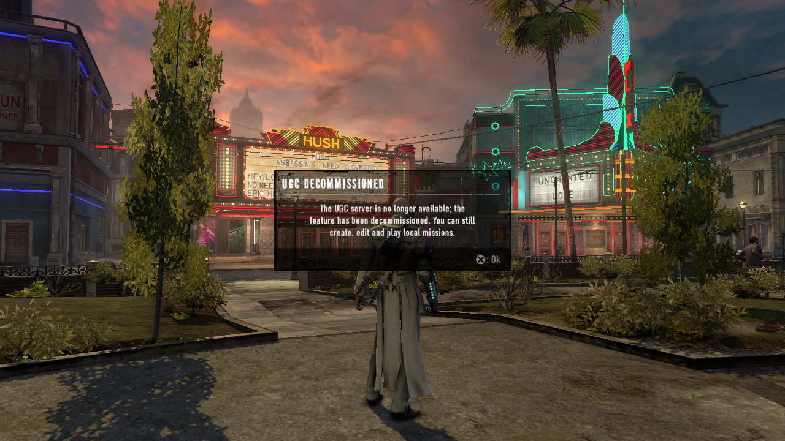
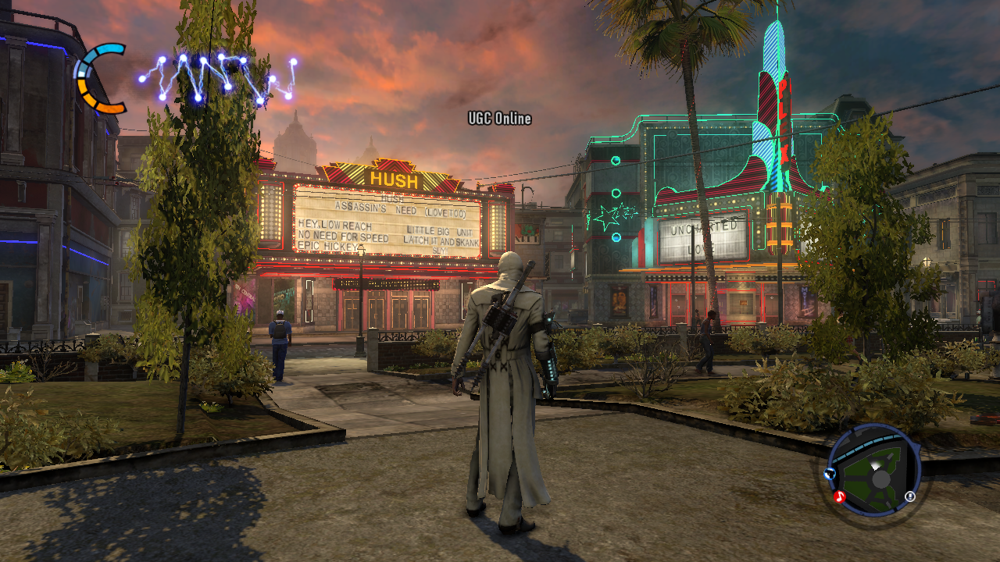
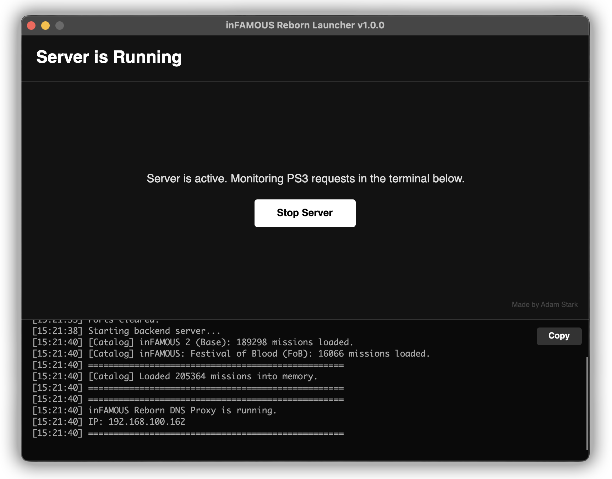

# inFAMOUS Reborn PS3
> [!IMPORTANT]
> This project brings back **205,364 missions** in total, supporting both games.  
Please leave a star ⭐ if you found this repository helpful!

A cross-platform custom server and launcher to restore User-Generated Content (UGC) functionality for **inFAMOUS 2** and **inFAMOUS: Festival of Blood** on the PlayStation 3.

| BEFORE | AFTER |
| :---: | :---: |
|  |  |

These screenshots are from inFAMOUS 2. I achieved the same result for inFAMOUS: Festival of Blood as well.

## Download
You can download the compiled versions for your operating system here:  
**[Download Latest Release.](LINK_TO_YOUR_GITHUB_RELEASES_PAGE_HERE)**

| UI Screenshot |
| :---: |
|  |

## How to Run
> [!NOTE]
> The application was tested on Windows 11 and macOS Tahoe.
### Windows
1. Extract the downloaded `.zip` file.
2. Run `inFAMOUSReborn.Launcher.exe`.

### macOS
1. Extract the downloaded `.zip` file.
2. Double-click the `inFAMOUS Reborn.app` bundle. 

## Setup Instructions

1. **Clear Ports:** Click the button in the Launcher to free Port 53 (DNS) and Port 80 (HTTP). These are required for the application to intercept PS3 traffic.
2. **Download Missions:** The Launcher will automatically download and extract the required mission files from Archive.org. These downloads might take a while depending on your connection, don't panic.
3. **PS3 Network Configuration:** 
   * On your PS3, go to **Settings > Network Settings > Internet Connection Settings**.
   * Select **Custom**.
   * Select **Wired Connection** or **Wireless**.
   * Go through the settings normally until you reach **DNS Setting**.
   * Select **Manual**.
   * Enter the IP address shown in the Launcher as your **Primary DNS**.
   * Leave the **Secondary DNS** blank (or `0.0.0.0`).
   * Save settings and test the connection.
4. **Optional Step:** Open the **Internet Browser** on your PS3 and head to http://infamous2-release.ps3.online.scea.com/. If you see my message, you're perfectly set.
5. **Start Server:** Once the files are ready, click "Start Server". The terminal will display if the missions loaded successfully and your local IP address. Boot the game.

## Troubleshooting

> **"The mission download fails or times out"**  
The automated download can time out if Archive.org servers are under heavy load. You can download the files manually:
* [Base Missions (inFAMOUS 2)](https://archive.org/download/infamous-2-ugc/maps_by_name.zip)
* [Festival of Blood Missions](https://archive.org/download/infamous-fob-ugc/maps_by_name.zip)

Extract them and place the contents into the `Missions/base` and `Missions/fob` directories next to the Launcher.

> **"0 Missions found / Infinite loading on search"**  
Check your folder structure. The game cannot read nested directories. Ensure your paths look exactly like this:
* `Missions/base/[mission files]`
* `Missions/fob/[mission files]`

Incorrect structure: `Missions/base/maps_by_name/[mission files]` (Remove the `maps_by_name` folder).

>**"Port 53 or Port 80 in use / Server fails to start"**  
If the built-in port clearer fails, manually kill the conflicting processes:
* **macOS:** Open Terminal and run `sudo killall httpd` and `sudo killall -HUP mDNSResponder`.
* **Windows:** Open Command Prompt as Administrator and run `net stop sharedaccess`. Also ensure Skype or IIS are not running.

## Tech Stack

* **Backend:** ASP.NET Core (Kestrel web server)
* **DNS Routing:** Custom DNS proxy handling UDP port 53 traffic to reroute PSN URLs to the local host.